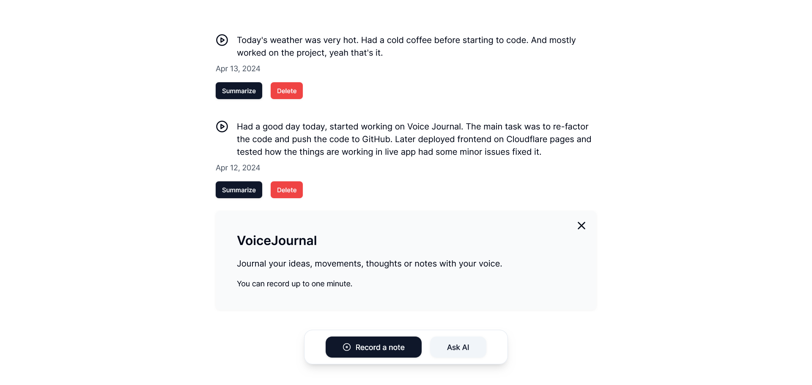

# VoiceJournal

Journal your ideas, thoughts or notes with your voice.

The frontend is located at: [web](./web)  
The AI Workers are located at: [worker](./worker)

## Demo

[⭐ Check it out here!](https://voicejournal.pages.dev/)

## Run locally

To run the code on your own machine first clone this repo.

### 🌐 web 

- After cloning `cd` into `web`
- Install dependencies with `npm install`
- Run locally with `npm run dev`

### 📡 worker 

- Change the directory to `worker`
- Install dependencies with `npm install`
- Develop locally with `npx wrangler dev`

🤖 This project is part of  [Cloudflare AI Challenge]()
